#  Sales Prediction and Demand Forecasting using Machine Learning for Peeppal( Organic Clothing Brand)
This repository presents a comprehensive solution for predicting retail sales and forecasting demand for various products using machine learning and time series analysis. The project aims to utilize historical sales data to predict future trends in retail sales, empowering businesses and to make data-driven decisions in inventory management, demand forecasting, and strategic planning. This is an amalysis based on real sales data taken from a startup company called SBL Organic Clothing LLP in Bangalore, India. The main objective is to analyse predictions and submit a detailed report as part of dissertation during my masters.

#  Table of Content:
1.Project overview

2.Dataset Overview

3.Data Exploration & Visualization Feature Engineering

4.Model Development & Evaluation

5.Time Series Forecasting (ARIMA)

6.Results & Forecasting 

## Project Overview
 The primary goal of this project is to predict future sales for different retail items, categorized by color, using historical sales data. The approach combines various machine learning techniques and statistical methods to build a robust forecasting model capable of predicting sales for future years.

## Key steps involved:

- Data Preprocessing: Cleaning and transforming raw data into a suitable format for machine learning models.

- Exploratory Data Analysis (EDA): Visualizing and understanding key trends and distributions in the dataset.

- Feature Engineering: Creating new features that will enhance model performance.

- Model Training: Implementing machine learning models like Linear Regression, Decision Tree, Random Forest, Ridge 
  Regression, and XGBoost to predict sales.

- ARIMA Forecasting: Using time series analysis to predict future sales for each item color (2020-2026).

## Dataset Overview:
-The dataset used in this project contains sales data for multiple retail items. Key columns in the dataset include:

1. ITEM_COLOR: The color of the item.

2. Year: The year of sale.

3. SALES: Total sales amount for each record.

4. Item ID and Item Name: Unique identifiers for each product.

5. Sales Date: The date when the sales occurred.

6. Site: Location where the item was sold.

The data provides a comprehensive view of sales trends over the years, enabling insights into product performance and demand.

## Data Exploration & Visualization:

- To gain insights into the dataset, we first performed exploratory data analysis (EDA). This step involved visualizing various aspects of the data, including:

1. **Sales Distribution**: Understanding how sales are distributed across years and colors.
   - **Key Insight**: Certain colors have seen higher sales than others.
   - The graph below shows the sales distribution over the years.

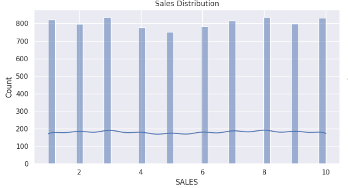
Figure 1: Distribution of sales data

**Item Color Frequency**:
- **Key Insight**: A bar chart illustrating the frequency of items in each color, helping to identify the most and least popular product colors.

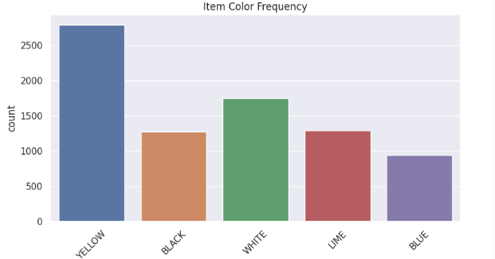
Figure 2: Frequency of items by color

**Sales Trend Over the Years**
- **Key Insight**: A time series visualization showing the total sales for each year, highlighting trends, growth, or declines over time.

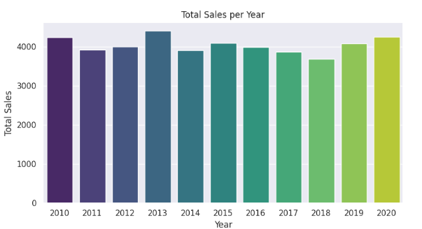

Figure 3: Total sales per year

**Sales by Site**
 **Key Insight**: A box plot visualizing sales distribution across different sites, revealing differences in sales performance across regions.

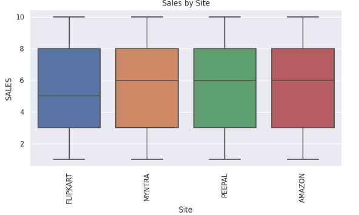

Figure 4: Sales distribution by site

## Data Analysis:
**1. Correlation Heatmap**
I used a heatmap to examine the linear relationships between numerical features in our dataset.

This helps us identify which variables are strongly or weakly correlated, High correlation between SALES and revenue generated per sale implies higher sales contribute more to revenue — a key business insight for forecasting.

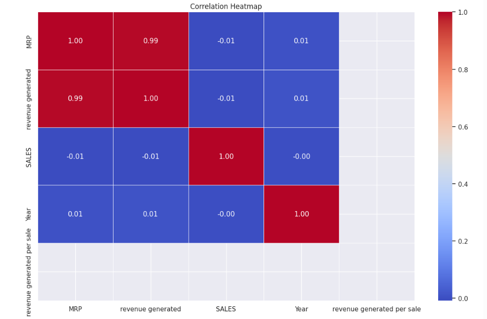

**Yearly Sales Trend**
I plotted total sales per year to uncover trends over time.

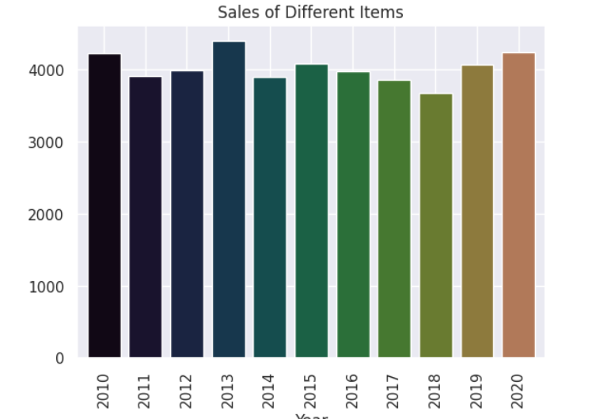

This helps in detecting seasonal patterns, growth trends, or sales decline.

## Feature Engineering:
- Feature engineering involved preparing the dataset for model training:
- Dropped columns:
- sales date – Converted to Year, so it’s redundant
- revenue generated, MRP – Avoid data leakage or irrelevant for model
- Removed target (SALES) from the test set to prevent it from influencing model predictions.
- Handling Missing Values: Missing values were handled appropriately to avoid any issues during model training.
- Categorical Variables Encoding: Using Label Encoding for categorical features such as ITEM_COLOR, Year, and Site to make 
  the data usable for machine learning algorithms.

## Model Development & Evaluation:

- Multiple machine learning models were employed to predict retail sales:

- **Linear Regression**: A basic linear model to predict sales based on various features.

- **Decision Tree Regressor**: A decision tree model to capture non-linear relationships.

- **Random Forest Regressor**: An ensemble model for improved accuracy and robustness.

- **Ridge Regression**: A regularized regression model to prevent overfitting.

- **XGBoost**: A powerful gradient boosting model known for its predictive performance.

For each model, performance was evaluated using the Root Mean Squared Error (RMSE) and Cross-Validation scores. 
The best-performing model was selected for forecasting future sales based on co-effiecients.

 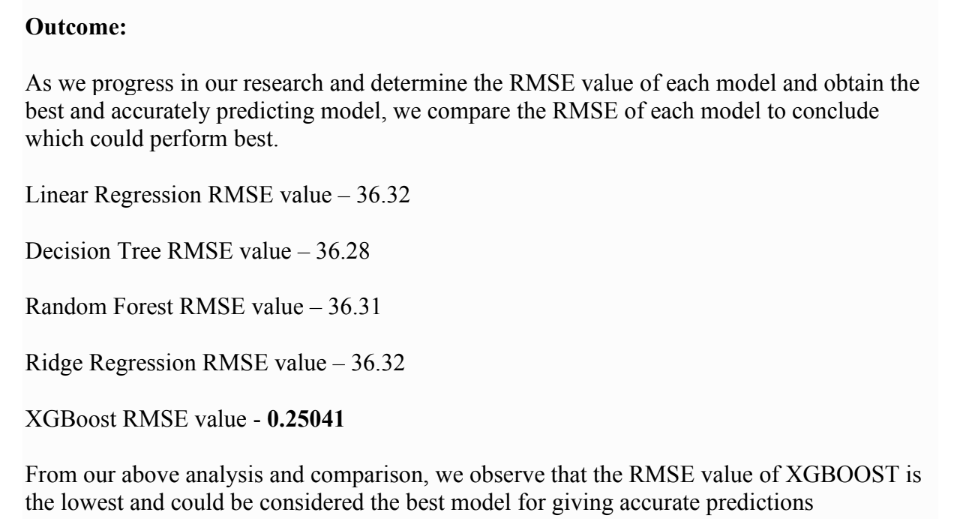

## Time Series Forecasting (ARIMA): 

**The ARIMA (AutoRegressive Integrated Moving Average) model was used to forecast future sales for each product color from 2020 to 2026**.

-Key steps included:

- Stationarity Check: Ensuring the data was stationary by checking for trends or seasonality and applying necessary transformations.

- Model Fitting: The ARIMA model was fitted on yearly sales data, and forecasted sales for the next 7 years were generated.

- Forecasting: Future sales were predicted for each color, visualized from 2020 to 2026.

The following graph shows both the historical sales data and the forecasted sales for a specific ITEM_COLOR:

**Forecasted sales for a specific product color (2020-2026)**:

- Sales forecast for white:
  
 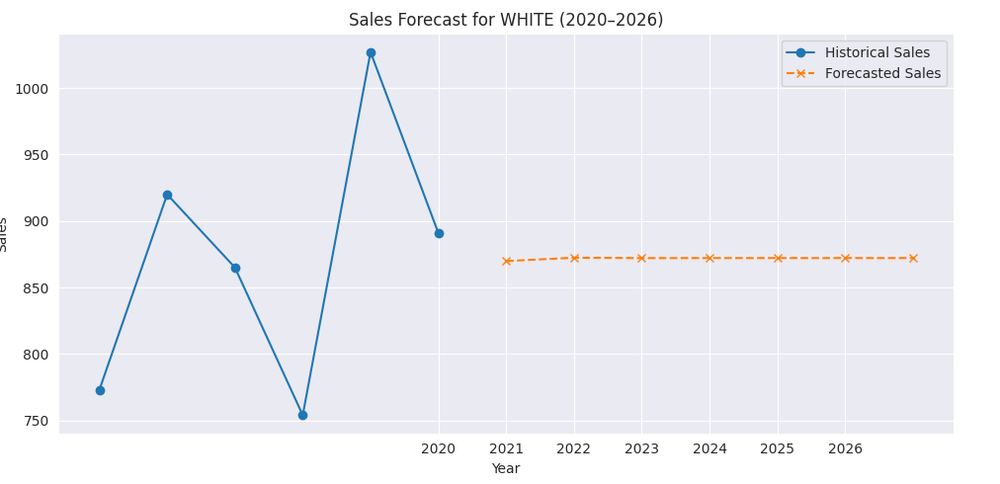
 

 
- Sales forecast for lime:
  
 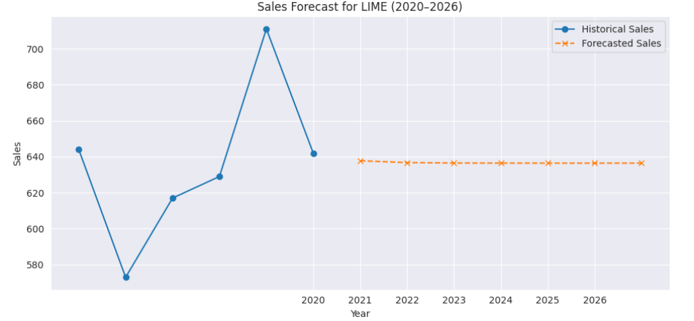
 
 

- Sales forecast for Blue:
  
 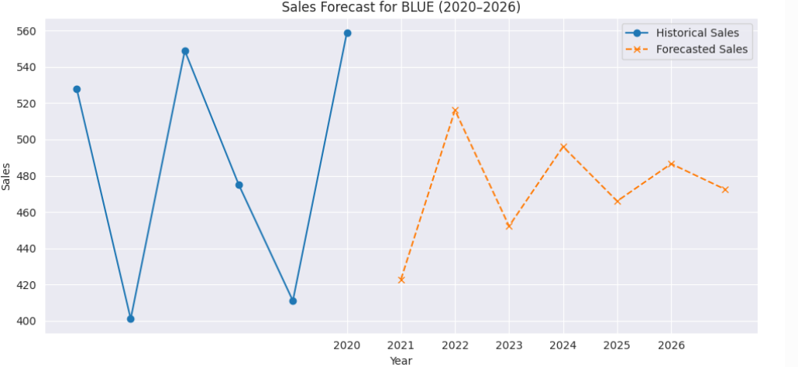

 

-Sales forecast for Yellow:

 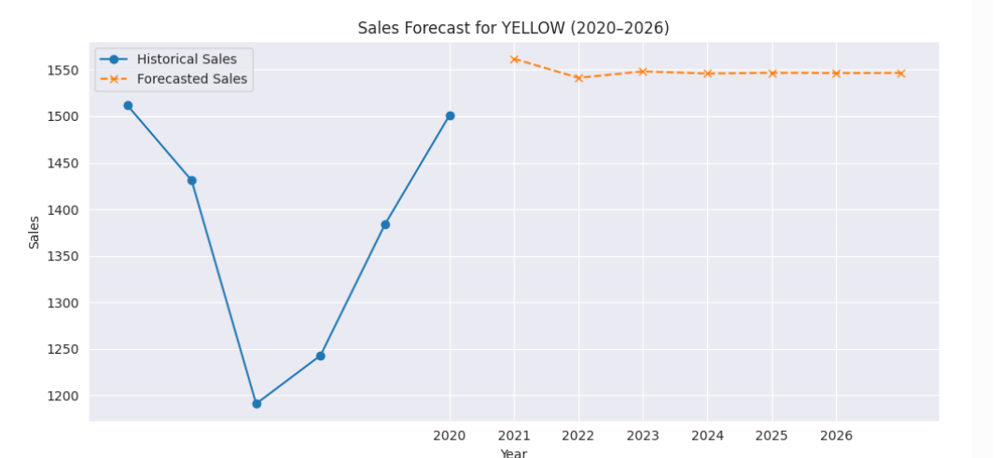

 

- Sales forecast for black:
  
 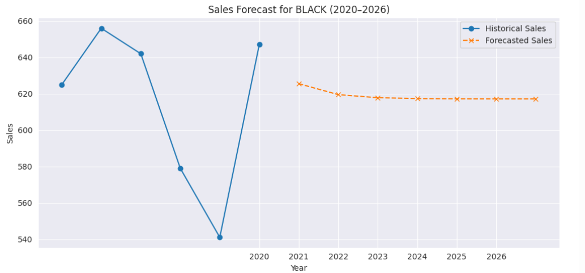

Results & Forecasting
After evaluating all models, the ARIMA model was used for time series forecasting, which provides a , year-over-year sales prediction for each ITEM_COLOR.

The results can be used for:

- Demand Forecasting: Anticipating future demand for different product colors.

- Inventory Management: Optimizing stock levels based on forecasted sales.

- Strategic Decision Making: Helping businesses plan marketing and sales strategies for future years.

